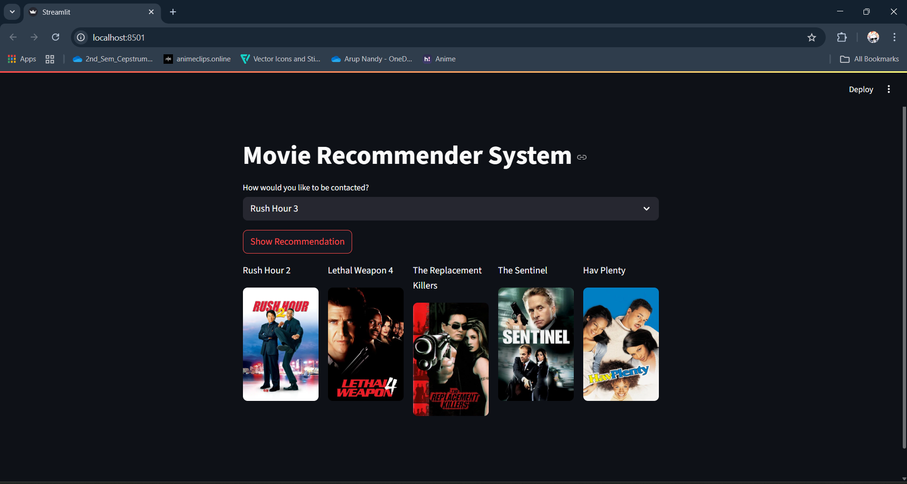

# 🎬 Movie Recommender System

A simple **content-based Movie Recommendation System** built using **Python, Streamlit, Pandas, and TMDb API**.  
It recommends movies similar to the one you choose and displays their posters.

---

## 🚀 Features
- Select any movie from a dropdown list
- Get **5 similar movies** instantly
- Displays **movie titles** with posters
- Uses **The Movie Database (TMDb) API** for poster fetching
- Clean, responsive UI built with Streamlit
- Handles missing posters with a **placeholder image**

---

## 📸 Demo
  

---

## 🛠️ Tech Stack
- **Python 3**
- **Streamlit** – Web app framework
- **Pandas** – Data handling
- **Requests** – API calls
- **Pickle** – Model and data loading
- **TMDb API** – Movie poster data

---

## 🛠 What You Need to Run This
Before you run this project, make sure you have:
- **Python 3.8+** installed  
- A **free TMDb API Key**  
  - Sign up here → https://www.themoviedb.org/  
  - Get your API key from **Settings → API**  
- The following Python libraries:
  - `streamlit`
  - `pandas`
  - `requests`
  - `pickle` (comes with Python)

---

